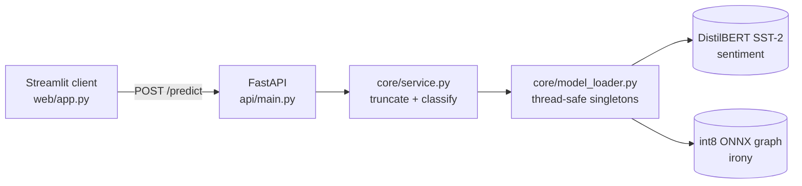

# NLP Sentiment Analysis Service

Classifies text sentiment and decides whether the input is ironic. Two DistilBERT
heads behind one FastAPI service, with a Streamlit client.


**Live Demo:** [Streamlit App](https://jorgeasmz-nlp-sentiment-analysis.streamlit.app/)

**Live API:** [Swagger UI](https://jorgeasmz-nlp-sentiment-analysis.hf.space/docs)

**Model:** [jorgeasmz/distilbert-irony-tweeteval](https://huggingface.co/jorgeasmz/distilbert-irony-tweeteval)

## Architecture



Four packages with one responsibility each: `core` owns the models, `api` owns
HTTP, `web` owns presentation, and `training` owns everything that produces an
artifact rather than serving one. The client reaches the service over HTTP only,
which is what lets the two halves be deployed independently. The training
package is absent from the serving image, since `Trainer`, a dataset loader and
a tracking server add layers that never answer a request.

## Why the service carries two heads

The sentiment checkpoint classifies at the sentence level from surface lexical
cues. On the curated evaluation set it is wrong on two of the three sarcastic
cases, and it returns both answers at a confidence of 1.00. The score therefore
does not separate the failures from the rest: a filter on confidence retains
exactly the predictions that are inverted.

That places the failure outside the reach of calibration, so the service answers
a second question instead. A head fine-tuned on TweetEval decides whether the
input is ironic, and its verdict travels with every sentiment response.

Fitting a logistic regression on the sentiment checkpoint's own output, a single
feature holding its confidence signed by polarity, recovers irony on the
TweetEval test split at an ROC-AUC of **0.479**. That is the measured form of the
same statement: the output of the deployed sentiment model carries no
information about whether its input is ironic.

## Results

### Irony on the TweetEval test split

784 held-out tweets, 39.7% of them ironic. Every row is a run recorded in
MLflow, and all of them decide at argmax, which is the rule the published
TweetEval numbers use.

| Model | Accuracy | Macro F1 | F1 ironic | Precision | Recall |
|---|---:|---:|---:|---:|---:|
| `sentiment-probe` | 0.523 | 0.467 | **0.294** | 0.356 | 0.251 |
| `majority-class` | 0.397 | 0.284 | **0.568** | 0.397 | 1.000 |
| `tfidf-logistic` | 0.667 | 0.659 | **0.605** | 0.571 | 0.643 |
| `frozen-4` | 0.663 | 0.660 | **0.624** | 0.560 | 0.704 |
| `full` | 0.672 | 0.672 | **0.664** | 0.559 | 0.817 |

`majority-class` predicts the training majority, which is the ironic label, so
it reaches perfect recall and no discrimination. `tfidf-logistic` is word and
character n-grams into logistic regression, and it measures what surface
features recover without a language model. `sentiment-probe` is the fitted
sentiment output described above. `frozen-4` holds the embeddings and the lowest
four transformer blocks fixed, leaving 14.8M of 67.0M parameters trainable;
`full` trains all of them and is the run that gets served.

### The decision threshold

| Operating point | Threshold | Accuracy | Macro F1 | F1 ironic | Precision | Recall |
|---|---:|---:|---:|---:|---:|---:|
| Argmax | 0.50 | 0.675 | **0.672** | 0.706 | 0.622 | 0.818 |
| Selected | 0.84 | 0.707 | **0.706** | 0.688 | 0.699 | 0.678 |

Argmax is the threshold 0.5, which is optimal only when the prior the model was
fitted on matches the one it is asked about. The shipped threshold is selected on
the validation split and written to `decision.json` beside the weights, so the
operating point is an artifact of training rather than a constant in the serving
code. `IRONY_THRESHOLD` overrides it without retraining.

Two choices in that step are worth stating.

The criterion is macro F1 rather than ironic-class F1, because both error
directions carry cost for a flag: a missed ironic text leaves a wrong sentiment
label unqualified, and a false alarm on plain text makes the flag uninformative.
Ironic-class F1 prices only the first. Selecting on it puts the threshold at
0.44 and raises validation ironic-F1 to 0.716, and it also raises the number of
curated cases the head flags from 17 to 25 out of 29.

The selection runs after the export rather than on the checkpoint. Quantisation
shifts the probability scale, so the same criterion lands on a different
threshold depending on which artifact it reads: **0.89** on the checkpoint
against **0.84** on the int8 graph. Selecting on the graph that is actually
served keeps the threshold and the scores it is compared against on one scale.

### Runtimes

Every runtime is held to one intra-op thread, which is what a container on a
free tier effectively gets, and decides at argmax, so the rows differ only in
the execution graph and the weight precision. Scoring them against the shipped
threshold instead would credit quantisation for the fact that the threshold was
selected on the quantised graph.

| Runtime | Size MB | p50 ms | p95 ms | Accuracy | F1 ironic |
|---|---:|---:|---:|---:|---:|
| `torch-fp32` | 268 | 67.3 | 87.6 | 0.672 | 0.664 |
| `onnx-fp32` | 269 | 35.2 | 51.7 | 0.672 | 0.664 |
| `onnx-int8` | 68 | 15.8 | 25.3 | 0.667 | 0.658 |

The service loads `onnx-int8`. Exporting the graph halves the latency at
identical weights, and quantising to int8 halves it again while cutting the
artifact from 268 MB to 68 MB, for 0.006 of ironic-class F1. On a free tier that
trade decides whether the image pulls and wakes in reasonable time.

### Sentiment on the curated set

29 hand-written cases grouped by the phenomenon each one probes. The last column
counts how many of them the irony head flags at the shipped threshold.

| Category | Correct | Accuracy | Flagged ironic |
|---|---:|---:|---:|
| Clear positive | 6/6 | 100% | 4/6 |
| Clear negative | 6/6 | 100% | 5/6 |
| Mixed sentiment | 4/4 | 100% | 3/4 |
| Negation | 4/6 | 67% | 0/6 |
| Short phrases | 3/4 | 75% | 3/4 |
| **Sarcasm** | **1/3** | **33%** | **2/3** |
| **Overall** | **24/29** | **82.8%** | **17/29** |

The five misclassifications, with the irony score alongside:

| Text | Expected | Predicted | Score | Irony |
|---|---|---|---:|---:|
| Oh brilliant, another update that breaks everything. | NEGATIVE | POSITIVE | 1.00 | 0.99 |
| Wonderful, it arrived in three pieces. Exactly what I wanted. | NEGATIVE | POSITIVE | 1.00 | 0.59 |
| Never again. | NEGATIVE | POSITIVE | 0.99 | 0.25 |
| There is nothing here I would change. | POSITIVE | NEGATIVE | 0.99 | 0.08 |
| I can't say I enjoyed a single minute of it. | NEGATIVE | POSITIVE | 0.78 | 0.83 |

### Limitations

This set is out of domain for the irony head, which is fine-tuned on tweets, and
the last column measures transfer rather than accuracy. It flags 17 of 29 cases,
including 5 of the 6 plainly negative ones, so on formal written English the
score is shifted upward and separates the classes poorly. The held-out figures
above are the ones that characterise the head; on text unlike a tweet the flag
should be read as a weak signal, and a deployment on such text would need its
threshold selected on a sample of it.

Reproduce every table above with:

```bash
python evaluate.py            # curated set, irony flags and end-to-end latency
python -m training.report     # everything recorded in MLflow
```

### Latency

Single-item inference on CPU across both heads, 29 calls after warm-up:

| Metric | ms |
|---|---:|
| Mean | 44.7 |
| p50 | 42.8 |
| p95 | 56.2 |
| Max | 77.3 |

## Training

```bash
pip install -r requirements-train.txt

python -m training.baselines                 # the references the head has to beat
python -m training.train                     # full fine-tuning
python -m training.train --freeze-layers 4   # comparison run
python -m training.export                    # ONNX graph plus its int8 copy
python -m training.benchmark                 # size, latency and quality per runtime
python -m training.calibrate                 # decision threshold on the served graph
python -m training.report                    # renders the tables above
python -m training.publish                   # uploads the artifact and its card
```

Each run records its hyperparameters, per-epoch metrics, held-out metrics and
confusion matrix. The tracking backend is SQLite, since MLflow 3 puts the
filesystem store into maintenance mode:

```bash
mlflow ui --backend-store-uri sqlite:///mlflow.db
```

`training/config.py` names the run that gets exported and served, so promoting a
different one is a one-line change.

## Quickstart

```bash
docker compose up --build
```

- Client: http://localhost:8501
- API docs: http://localhost:8000/docs

The image bakes both heads in at build time, so a cold container does not spend
its first request downloading them. The client waits on the API health check
before starting.

### Without Docker

```bash
python -m venv venv && source venv/bin/activate
pip install -r requirements.txt

uvicorn api.main:app --reload      # API on :8000
streamlit run web/app.py           # client on :8501, in another shell
```

## Deployment

The pieces are hosted separately and joined by environment variables.

| Component | Host | Built from |
|---|---|---|
| API | [Hugging Face Spaces](https://jorgeasmz-nlp-sentiment-analysis.hf.space/docs), Docker SDK | `Dockerfile` |
| Client | [Streamlit Community Cloud](https://jorgeasmz-nlp-sentiment-analysis.streamlit.app/) | `web/app.py` |
| Irony head | [Hugging Face model repository](https://huggingface.co/jorgeasmz/distilbert-irony-tweeteval) | `training/publish.py` |

The Space serves the API only, so `/docs` is its usable entry point. On
Streamlit Cloud the backend location goes under **Settings - Secrets**:

```toml
API_URL = "https://jorgeasmz-nlp-sentiment-analysis.hf.space"
```

The container binds to `$PORT` when the platform sets it and falls back to 7860,
the port declared in this file's front matter.

**Cold starts.** A free Space sleeps when idle and needs time to wake and load
both heads, so the client allows 90 seconds (`API_TIMEOUT`) and reports a
timeout explicitly instead of looking broken.

This repository has two remotes: `origin` on GitHub and `space` on Hugging Face.
Publishing the API means pushing to both. The irony head is in neither: it lives
in its own model repository, which is what `IRONY_MODEL_REPO` points at.

## Development

```bash
pip install -r requirements-dev.txt

pytest              # 40 tests, 96% coverage of api/ and core/
ruff check .
```

The suite never downloads a model. Every test drives a fake pipeline or a fake
ONNX session and asserts on how it was called, so it runs in seconds.

## Technical decisions

**The CPU wheel index is declared on its own line.** In a requirements file
`--extra-index-url` is a global directive, and appended to a requirement it is
ignored, at which point pip resolves torch from PyPI and pulls the CUDA build:
several GB of NVIDIA libraries for a CPU-only service.

**Training dependencies are a separate file.** `requirements-train.txt` carries
`Trainer`, `datasets`, MLflow and the exporter. The serving image installs
`requirements.txt` only, so none of that reaches a container whose job is to
answer requests.

**Both heads load once, behind a lock.** FastAPI runs synchronous endpoints in a
worker threadpool, so without it two concurrent first requests could each start
loading the same checkpoint. The check outside the lock keeps the common path
uncontended.

**Truncation is explicit, and each head reads the width it was trained at.**
DistilBERT accepts 512 tokens and the tokenizer raises on longer input rather
than trimming it, so a pasted article would surface as a 500. The irony head is
truncated at 96 tokens, the width it was fine-tuned on, and a test asserts that
the serving constant and the training constant agree.

**Readiness covers both heads.** Every response carries an irony verdict, so a
service with one head loaded is not a service that can answer. A failed load
leaves `model_ready` false and the process alive, which lets an orchestrator
report a degraded state instead of restarting the container forever.

**Stale shape metadata is dropped before quantisation.** The ONNX exporter
records shapes for intermediate tensors and then optimises the graph without
updating them. The quantiser re-runs shape inference, finds the contradiction
and refuses the file; removing the entries lets it recompute them.

**The decision threshold ships with the weights.** `decision.json` travels in
the model repository and the loader reads it, so the operating point is not
restated as a constant in serving code.

**The Compose cache mount matches `HF_HOME`.** A volume mounted anywhere else
caches nothing, and every start re-downloads the weights.

## Project structure

```text
NLP-Sentiment-Analysis/
├── api/
│   ├── main.py           # FastAPI app, lifespan, endpoints
│   └── schemas.py        # Pydantic request/response models
├── core/
│   ├── config.py         # Checkpoints, token limits, artifact location
│   ├── irony.py          # ONNX Runtime session for the irony head
│   ├── model_loader.py   # Thread-safe singletons for both heads
│   └── service.py        # Inference and response shaping
├── training/
│   ├── config.py         # Hyperparameters, paths, served run
│   ├── data.py           # TweetEval splits and encoding
│   ├── metrics.py        # Metric definitions and threshold search
│   ├── baselines.py      # Majority, n-grams, sentiment probe
│   ├── train.py          # Fine-tuning with MLflow tracking
│   ├── export.py         # ONNX export and int8 quantisation
│   ├── benchmark.py      # Size, latency and quality per runtime
│   ├── calibrate.py      # Decision threshold on the served graph
│   ├── report.py         # Renders the tracked runs as tables
│   └── publish.py        # Uploads the artifact and its model card
├── web/app.py            # Streamlit client
├── evaluate.py           # Curated set, irony flags and latency
├── data/eval_set.json    # Curated evaluation cases
├── tests/                # pytest suite, fully offline
├── Dockerfile            # Bakes in both heads, serves the API
├── docker-compose.yml    # API + client
└── ruff.toml             # Lint rule selection
```
