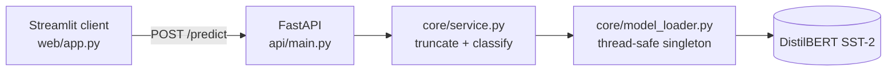

# NLP Sentiment Analysis Service

Classifies text sentiment with a fine-tuned DistilBERT, served as a FastAPI
service with a Streamlit client.


**Live Demo:** [Streamlit App](https://jorgeasmz-nlp-sentiment-analysis.streamlit.app/)

**Live API:** [Swagger UI](https://jorgeasmz-nlp-sentiment-analysis.hf.space/docs)

## Architecture



Three layers with one responsibility each: `core` owns the model, `api` owns
HTTP, `web` owns presentation. The client talks to the service over HTTP only,
which is what lets the two halves be deployed independently.

## Results

Measured on a curated set of 29 cases grouped by the phenomenon each one probes.
The checkpoint is pre-trained, so the useful question is not "how accurate" but
**where it breaks and how fast it answers**.

| Category | Correct | Accuracy |
|---|---:|---:|
| Clear positive | 6/6 | 100% |
| Clear negative | 6/6 | 100% |
| Mixed sentiment | 4/4 | 100% |
| Negation | 4/6 | 67% |
| Short phrases | 3/4 | 75% |
| **Sarcasm** | **1/3** | **33%** |
| **Overall** | **24/29** | **82.8%** |

### Where it fails, and how confidently

The failures are not near the decision boundary. They come back at maximum
confidence:

| Text | Expected | Predicted | Score |
|---|---|---|---:|
| Oh brilliant, another update that breaks everything. | NEGATIVE | POSITIVE | 1.00 |
| Wonderful, it arrived in three pieces. Exactly what I wanted. | NEGATIVE | POSITIVE | 1.00 |
| Never again. | NEGATIVE | POSITIVE | 0.99 |
| There is nothing here I would change. | POSITIVE | NEGATIVE | 0.99 |
| I can't say I enjoyed a single minute of it. | NEGATIVE | POSITIVE | 0.78 |

A sentence-level classifier reads surface lexical cues, so sarcasm inverts its
answer while leaving the confidence untouched. **The score cannot be used as a
trust signal**: filtering on it would keep exactly the wrong predictions. Any
production use on user-generated text needs a different design, not a threshold.

### Latency

Single-item inference on CPU, 29 calls after warm-up:

| Metric | ms |
|---|---:|
| Mean | 36.6 |
| p50 | 35.6 |
| p95 | 46.8 |
| Max | 50.2 |

Reproduce both tables with:

```bash
python evaluate.py
```

## Quickstart

```bash
docker compose up --build
```

- Client: http://localhost:8501
- API docs: http://localhost:8000/docs

The image bakes the weights in at build time, so a cold container does not spend
its first request downloading 250 MB. The client waits on the API health check
before starting.

### Without Docker

```bash
python -m venv venv && source venv/bin/activate
pip install -r requirements.txt

uvicorn api.main:app --reload      # API on :8000
streamlit run web/app.py           # client on :8501, in another shell
```

## Deployment

The two halves are hosted separately and joined by one environment variable.

| Component | Host | Built from |
|---|---|---|
| API | [Hugging Face Spaces](https://jorgeasmz-nlp-sentiment-analysis.hf.space/docs), Docker SDK | `Dockerfile` |
| Client | [Streamlit Community Cloud](https://jorgeasmz-nlp-sentiment-analysis.streamlit.app/) | `web/app.py` |

The Space serves the API only, so `/docs` is its usable entry point. On
Streamlit Cloud the backend location goes under **Settings - Secrets**:

```toml
API_URL = "https://jorgeasmz-nlp-sentiment-analysis.hf.space"
```

The container binds to `$PORT` when the platform sets it and falls back to 7860,
the port declared in this file's front matter.

**Cold starts.** A free Space sleeps when idle and needs time to wake and load
the checkpoint, so the client allows 90 seconds (`API_TIMEOUT`) and reports a
timeout explicitly instead of looking broken.

This repository has two remotes: `origin` on GitHub and `space` on Hugging Face.
Publishing the API means pushing to both.

## Development

```bash
pip install -r requirements-dev.txt

pytest              # 16 tests, 96% coverage of api/ and core/
ruff check .
```

The suite never downloads the model: every test drives a fake pipeline and
asserts on how it was called, so it runs in about a second.

## Technical decisions

**The CPU wheel index is declared on its own line.** `requirements.txt`
previously read `torch --index-url https://.../cpu`. That option is a global
directive in a requirements file, and appended to a requirement it is ignored,
so pip resolved torch from PyPI and pulled the CUDA build: a 4 GB environment of
NVIDIA libraries for a CPU-only service. Fixed, the same install is 1.5 GB.

**The model loader is a locked singleton.** FastAPI runs synchronous endpoints
in a worker threadpool, so without the lock two concurrent first requests could
each start loading a 250 MB checkpoint. The check outside the lock keeps the
common path uncontended.

**Truncation is explicit.** DistilBERT accepts 512 tokens and the tokenizer
raises on longer input rather than trimming it, so a pasted article would have
surfaced as a 500. `analyze_text` passes `truncation` and `max_length` on every
call.

**The health check reports readiness and a failed load does not crash the
service.** A checkpoint that will not load leaves `model_ready` false and the
process alive, which lets an orchestrator report a degraded state instead of
restarting the container forever.

**The Compose cache mount matches `HF_HOME`.** It previously pointed at
`/root/.cache/huggingface` while the image set the cache to `/app/.cache`, so
the volume cached nothing and every start re-downloaded the weights.

**`web/` is copied into the image.** Compose runs the Streamlit client from the
same image, and without it that service had no entry point and never started.

## Project structure

```text
NLP-Sentiment-Analysis/
├── api/
│   ├── main.py           # FastAPI app, lifespan, endpoints
│   └── schemas.py        # Pydantic request/response models
├── core/
│   ├── config.py         # Checkpoint name and token limit
│   ├── model_loader.py   # Thread-safe pipeline singleton
│   └── service.py        # Inference and response shaping
├── web/app.py            # Streamlit client
├── evaluate.py           # Accuracy by category and latency
├── data/eval_set.json    # Curated evaluation cases
├── tests/                # pytest suite, fully offline
├── Dockerfile            # Bakes in the weights, serves the API
├── docker-compose.yml    # API + client
└── ruff.toml             # Lint rule selection
```
